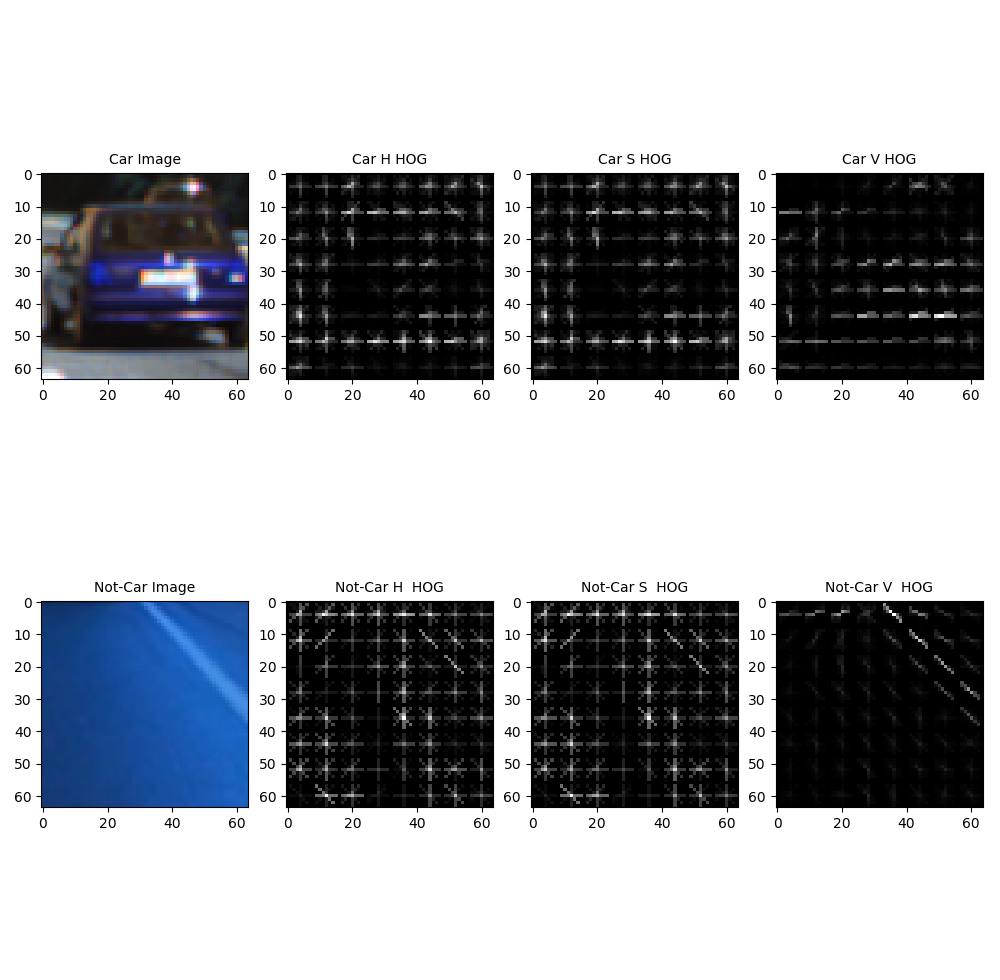
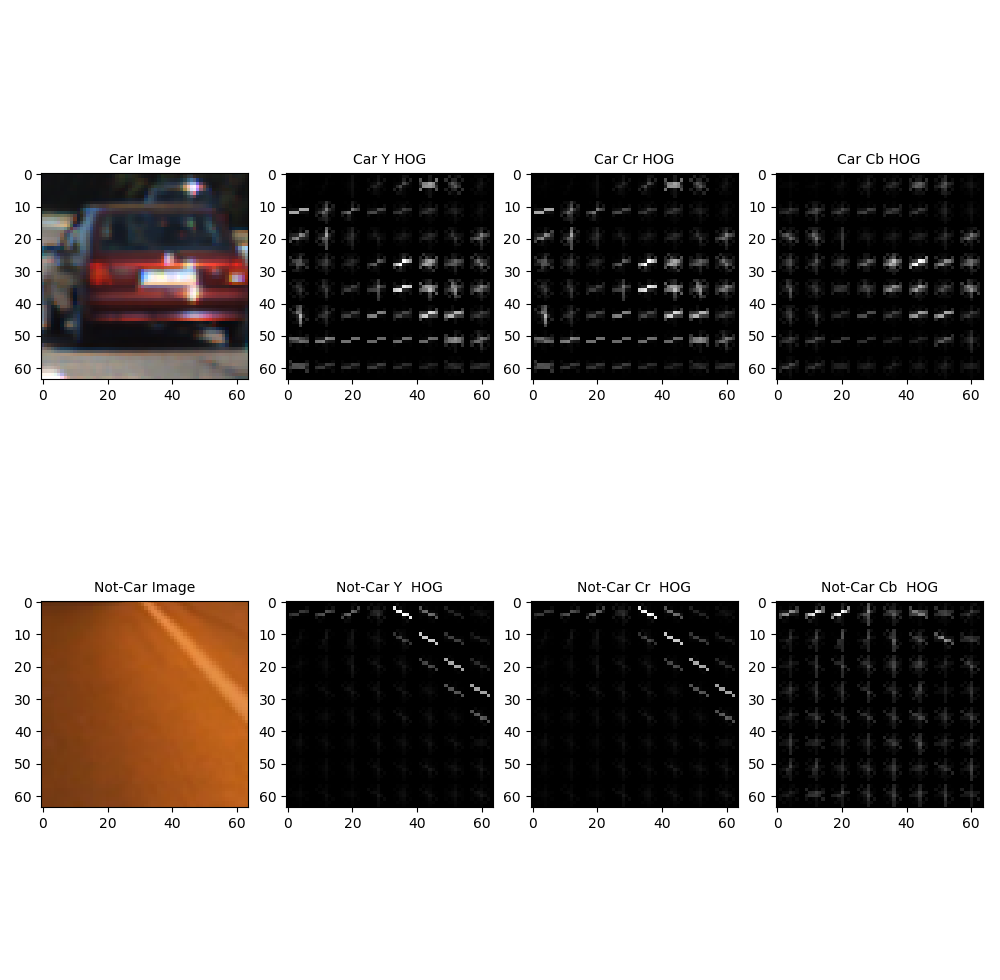
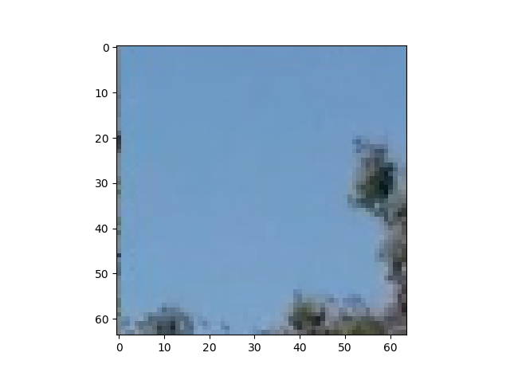
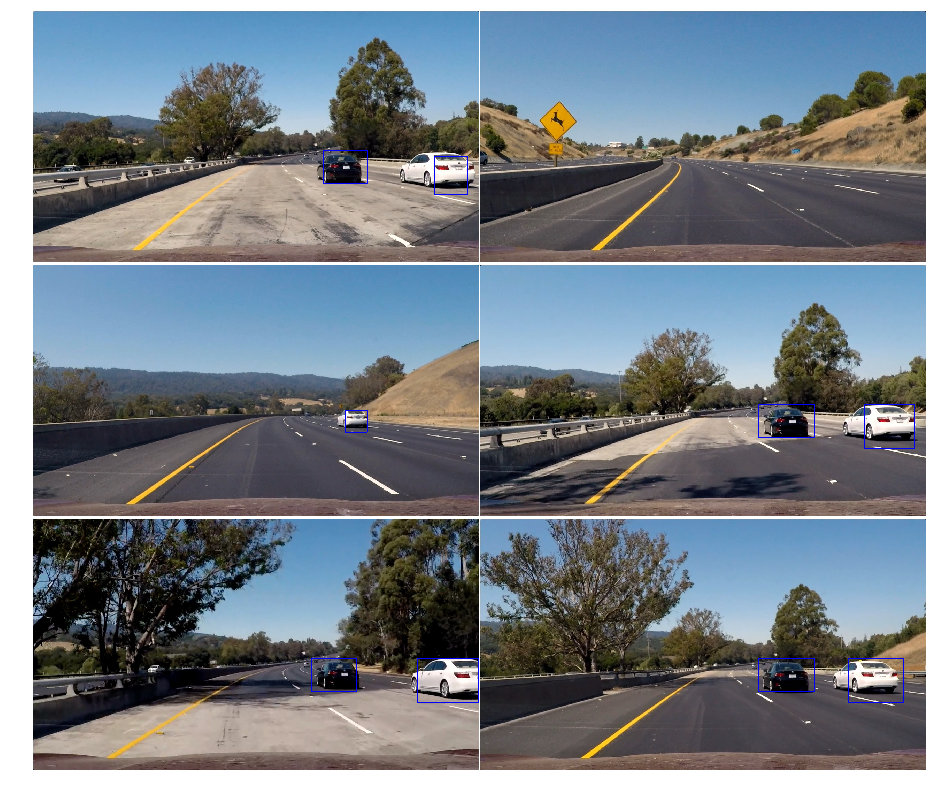

# Vehicle Detection

# Project Goals
---
The goals / steps in this project are the following:

* Build features from images such as color histogram/spatial bins and HOG which are useful in predicting cars in a given image
* Train a SVM classifier with labeled car and noncar images based on features extracted
* Detect vehicles in a image/video stream based on sliding window technique using trained model as predictor.
	* Use of heat map technique and previous frame data to remove false positives
* Summarize the results with a written report.

 *An image with Vehicles annotated*

# Overview
---

This project is next step to Advance Lane Finding Project. In this Project Vehicle(s) in video stream is to be identified and marked. Together with detection of Lane and other vehicle, enables subject vehicle to apply appropriate control parameters to drive autonomously.The vehicle detection, in this project has been achieved by building features using vision processing methods such as color histogram/spatial binning and HOG and training a SVM based classifier on a labeled dataset of cars and not-car images.The trained model is then used to run a grid/window search patches of image and identifying vehicle matches and generating bounding boxes. The problem occurs with False positives in the detection step, a heatmap method is implemented to reduce/remove false positives.

The project implementation pipeline in this project consist of following steps:

1. Analyze images and find an appropriate color space to extract useful features
2. Features extraction which is combination of features based on color histogram,spatial binning and HOG 
3. Train a Support Vector Machine classifier
4. Implement a sliding-window (based HoG subsampling method) with multiple sizes and use the classifier to search the vehicle and generate bounding boxes for locations predicted as match for a vehicle
5. Generate of Heatmap and threshold to adjust multiple detections from multiple windows of sliding windows
6. Smoothen the bounding boxes based on previous frame results to remove false positives

# Analyze images and find an appropriate color space to extract useful features
---
For this project, a labeled dataset is provided.These example images come from a combination of the [GTI vehicle image database](http://www.gti.ssr.upm.es/data/Vehicle_database.html), the [KITTI vision benchmark suite](http://www.cvlibs.net/datasets/kitti/). There are few examples extracted from the project video itself that are used for building and experimenting various functions in the project.

Here is a snapshot of images from labeled dataset.

There are **8792**  car images and **8968** noncar images in the dataset.These pictures are of 64x64 pixel size. 

A suggestion has been made to be careful with data as they are time-series.
***For the project vehicles dataset, the GTI* folders contain time-series data. In the KITTI folder, you may see the same vehicle appear more than once, but typically under significantly different lighting/angle from other instances.While it is possible to achieve a sufficiently good result on the project without worrying about time-series issues, if you really want to optimize your classifier, you should devise a train/test split that avoids having nearly identical images in both your training and test sets. This means extracting the time-series tracks from the GTI data and separating the images manually to make sure train and test images are sufficiently different from one another.***

No special method is applied to shiffle tha data,train_test_split from sklearn module is used.

Color spaces such as HSV/YUV and YCrCb is explored and YUVC/YCrCB seems to identify color features well.

YCrCb color space is chosen to extract features on in this project as it shows grouping of features promonently.

# Features extraction (features based on color histogram,spatial binning and HOG )
---
The classifier needs to be trained of features that reprent car or notcar data with important features.
The features used are:

**Color Histogram:**
 The color channels of an image in given space are divided into bins and hence represents color combinations and saturation/hue/brightness combinations to train classifier on. Here is an example of color histogram:

**Spatial binning:**

Spatial binning: Color itself doesn't represent a significant learning feature set as cars can be of many different colors, the spatial appearence of vehicle in an image is also a useful metric that can be used as a feature. The car/notcar image is resized and the value of pixels are stored as feature sets. Here is an example:

**Histogram of Oriented Gradients (HOG):**

HOG is a way to extract meaningful features of a image independent of color values. It captures the “general aspect” of cars, not the “specific details” of it. It is a gradient based method same class as Soebel used in previuos project but the kernel applied here is 1D (-1,0,1).The HOG method finds color gradient direction in cells (image divided in set of pixels) and then creates a histogram of gradient directions as feature set. Normalization can be applied based on group of cells called block. This makes the feature set robus to variations such as shadows.If normalization is applied, the features set  may be greater than number of cells.

More info about HoG can be found at:[Youtube link](https://www.youtube.com/watch?v=7S5qXET179I) and [here](http://lear.inrialpes.fr/people/triggs/pubs/Dalal-cvpr05.pdf)

Here are some HOG features from different color spaces:

**HOG features**

The choice of bins (orientation) of directtion,pixels per cell and blocks per cell are hyperparameters for HOG, value of 11 for direction,8 bfor pix per cell and 2 blocks per cell was found to be optimum.

**orient=8,pix_cell=8,blocks_per_cell=2**

**orient=11,pix_cell=8,blocks_per_cell=2**

**Feature set**
A feature set is prepared based on color histogram/spatial bin and HOG is prepared. To reduce tome for training and prediction one or more combination of these features can be deployed.
Here is example of features extracted:

**feature for an example cars image**

**feature for an example non-cars image**

As can be observed from the pictures above,
the feature set values are vastly different because they represent different quantities.
From package sklearn.preprocessing  method StandardScaler is used to normalize the feature set around 0 is used to normalize and scale the data.
The data is split into train and validation set using test_train_split method of sklearn.model_selection package.since test_train_split shifles the data before splitting,no special method is used to randomize time-series labeled data. 

# Train a Support Vector Machine classifier
---
The next step is to train a classifier. 
A support vector machine with linear kernel is used as classifier. Support vector machine is large margin classifier. 
RBF and Linear kernel was experimented with, the accuracy reached with rbf kernel was 98.7% and with Linear about 98.3% The linear kernel is used in the project.However, it took 157.22 seconds to train svm with rbf kernel and 14.1 seconds for Linear kernel.
For the purpose of this project Linear kernel SVM is used from imported from sklearn.svm as LinearSVC.

The classifier and associated parameters for features including StandardScalar was saved in a pickle file to be used while applying on the image/videostreams for vehicle detection.

# Implement a sliding-window to detect Vehicle(s):
---
The sliding window method that uses HOG subsampling described in the lectures of the project is used to detect vehicles. The function implemented is called 'find_cars' and it combines  feature extraction (color_hist,spatial_bin and HOG) with a sliding window search. However, it extracts HOG features only once on the full image or selected image area and then subsamples according to the window applied. This method is more effiecient than generating all the features incl. HOG for every window in the sliding-window method. The color and  spatial bin feature is also extracted and concatenated along with HOG features to makeup the feature list to predict if the window matches a vehicle signature using trained model described in previous section. The image patch in the widnow is scaled to 64x64 pixel size which was the size of images in the training set.

# Generate Heatmap and threshold to remove false positives
---
A variation on the lecture function (suggested in lecture) is implementation of multiple windows sizes  for searching vehicles. This is important as depending on the location (distance away) of the vehicles from the camera they may appear bigger (closer) or smaller (farther).Also, the upper part of the image will not ,typically, have vehicles but rather landscape, so, about a little less that half of the top pixels are excluded from vehicles search. This saves processing time.

 *Vehicles detected with multi sized window*

There are false positives (window defined as match where there is no vehicle) detected apart from vehicles in images. False positives are generally accompanied by only one or two detections in multi-sized image search, while true positives occur more frequently. This concept is used to generate what is called a 'HeatMap' of the detections. Starting with a black image (pixel value 0),pixels in the the detected bounding boxes  list are added  to generate heatmap and then a threshold is applied (typically of 1 or 2 ) to discard bounding boxes where pixel value was less than threshold to generate final bounding box for vehicles.

 *Heatmap and threshold application on vehicles detected*

The **scipy.ndimage.measurements.label()** function is used to collect spatially contiguous areas of the heatmap and assigns each a label.

 *Vehicles detected and labels applied*

# Smoothen the bounding boxes based on previous frame results to remove false positives
---
The implementation based on above steps performs well except that in few images even after applying heat map false positives are found in video stream pipeline. In the pipeline for video frame implementation, a class for frame tracking(Frame_Detect) is implemented. The idea is to use information over multiple frames and apply knowledge from previous frames to add to decision of vehicle match (this is an additional method to heatmap) to remove false positives. The information used in the implementation is averaging heatmap bounding boxes over certain number of frames. 
However, other method such as number of cars detected in previous frames and/or combination of such information over multiple frames can be used to make vehicle match prediction robust.

### To summarize
---
Color histogram (32 bins),spatial binning(size 32x32) and HOG (11 orientations/8 pix per cell/2 cells per block) methods are used to generate features to train a Linear SVM and sliding window method in combination with HOG subsampling to generate heatmap and averaging heatmap over multiple frames is used to detect vehicle in given image/videostream.

# Pipeline
---
The pipeline is a function which puts all the above steps together and applies to the frames on the videostream.
Here is an example of vehicle detection on the test_video, on the top left is the depiction of heat map.

 *Vehicle detection*

# Files and Results
---

The project implementation is in a jupyter notebook: [Vehicle_Detection.ipynb](Vehicle_Detection.ipynb)

The output/processes video results are:
Project video: [project_video_out.mp4](project_video_out.mp4)

The pickle file of trained model is: **colorspace_YCrCb_spatialbin_True_colhist_True.p**

The images generated from various functions  are in directory: [output_images](output_images)

unit tests for each of the functions used in the project can be found in main directory of this repo.

**There are few frames where rails appear and are mis-detected in this implementation**

# Summary and Discussion 
---
The major problem faced  in this project are the false positives.Too many window sizes increases false positives while too few missed detections. The cars from opposite lane and rails on the side of road are often misclassified. Improving SVM accuracy using other kernels and increasing sample size for training may be useful. The dataset has about 9000 samples of cars/nocars each. Augmenting while training is an option that is not explored in this project.However, this may increase processing time on frames. Averaging detections over previous frames mitigates the effect of the mis-detection, but the problem is vehicles changing position  are delayed in detection. 

The implementation can be made more robust by tracking few more items apart from heatmap,boundingboxes over frames such as number of cars in consecutive frames, prediction of vehicle positions. 

The other important aspect to be careful about (Tips and Tricks section of lectures) is the difference between image values as readin by opencv and matplotlib.images modules. images needs to scaled appropriately, opencv imread reads in 0-255 range for images though in BGR space, mpimg imread reads png images as 0-1, which is problem for color histogram bins if not scaled.

Shuffling of data is also suggested as the sample data for training is time-series but is not implemented in this project.

